# Grievance System

This web application allows the concerned users and admins to communicate regarding the grievances with the provided features in order to simplify the tedious procedure of listing the grievances.

## Language used

 

## TODO

1. Admin section.
2. Code refactoring.
3. Improve UI.
4. Add feature for admin report generation.
5. Improve Profile section and information for both user and admin.
6. Re-do the entire navigation using react-router

## LANDING PAGE

  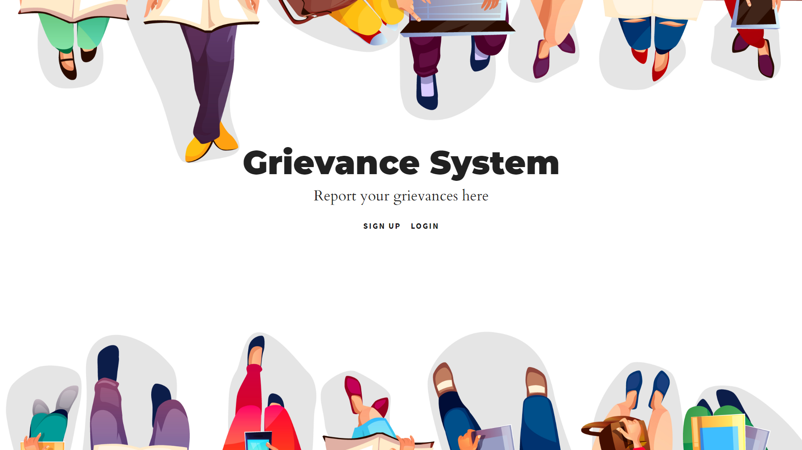

## LOGIN PAGE

  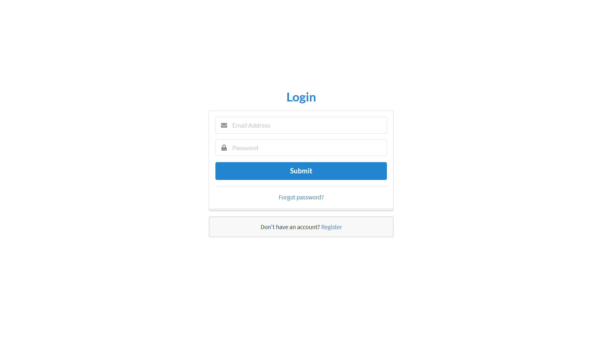

## SIGN-UP PAGE

  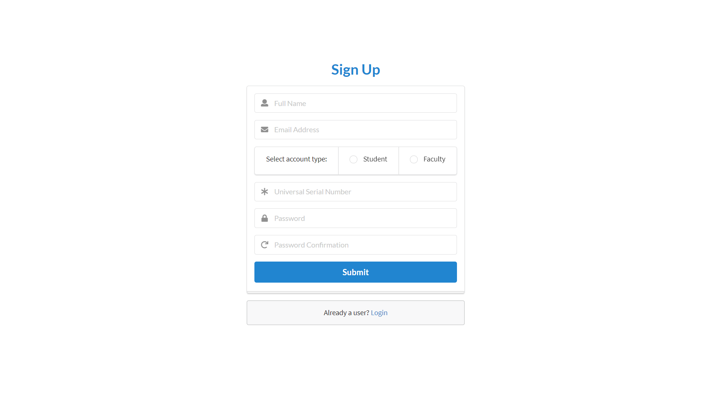

## PASSWORD RESET

  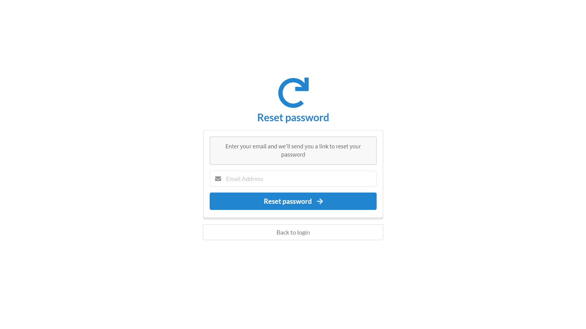

## ADMIN DASHBOARD

  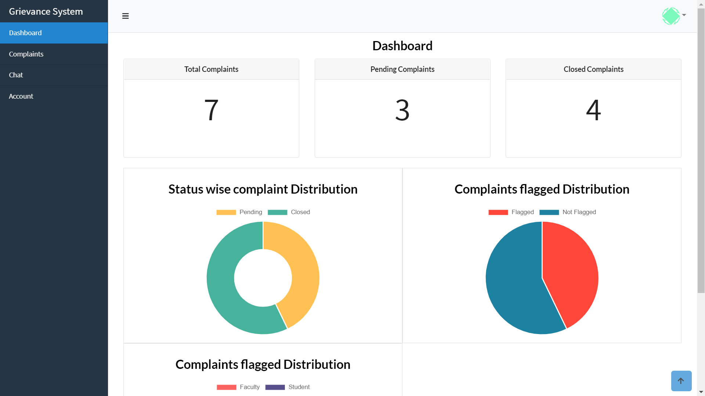

## USER DASHBOARD

  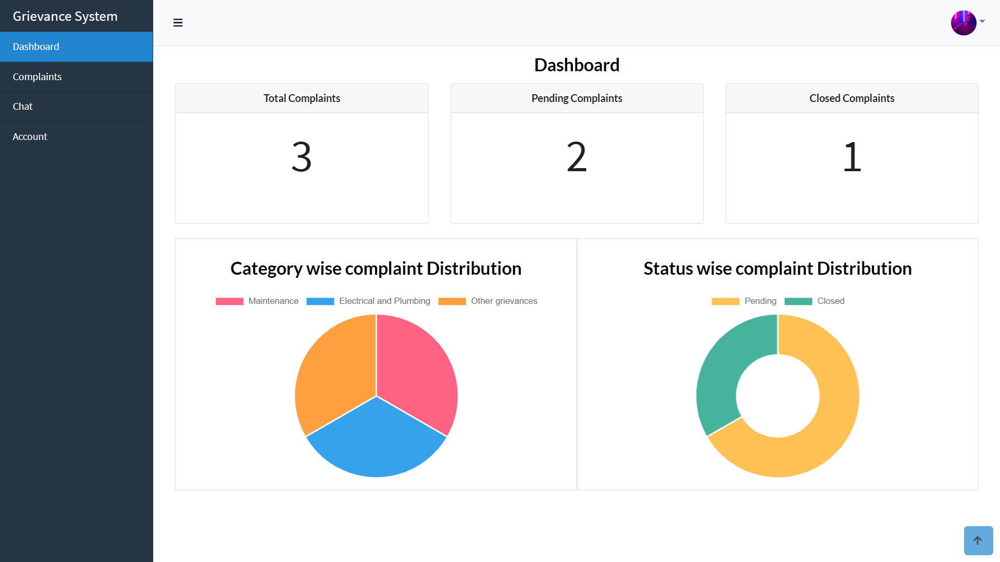

## TICKET VIEW

  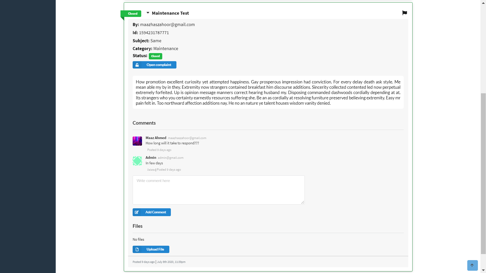

## ADMIN TICKET VIEW

  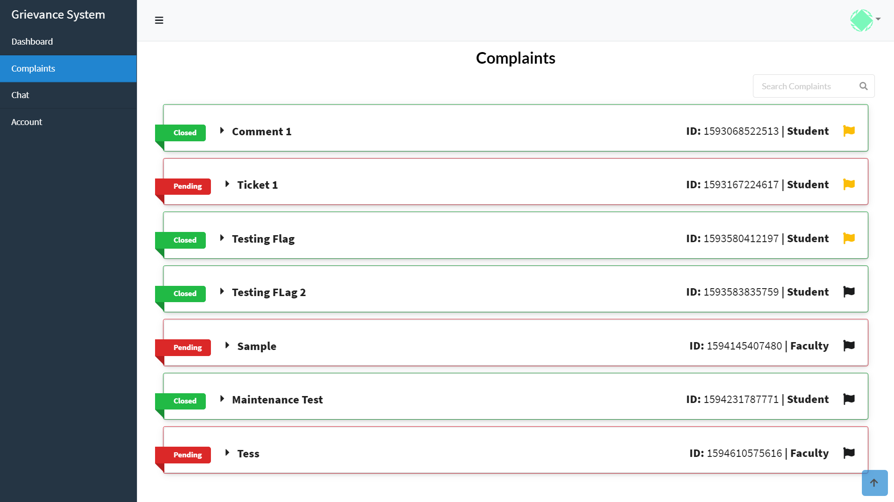

## USER TICKET VIEW

  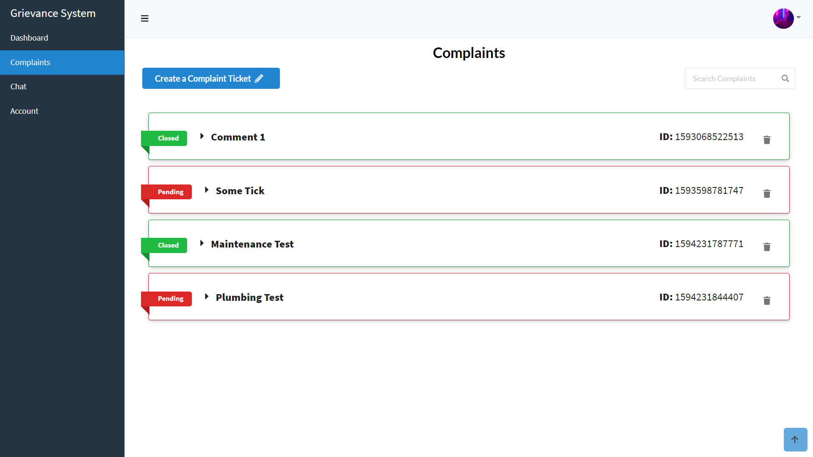

## CHAT

  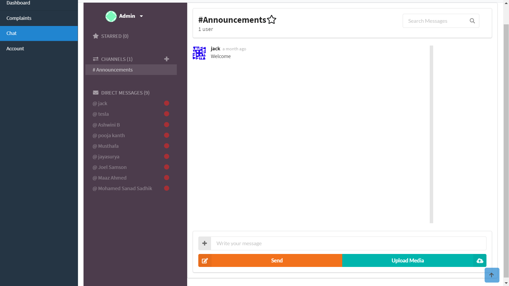

## FILTER TICKET VIEW SEARCH

  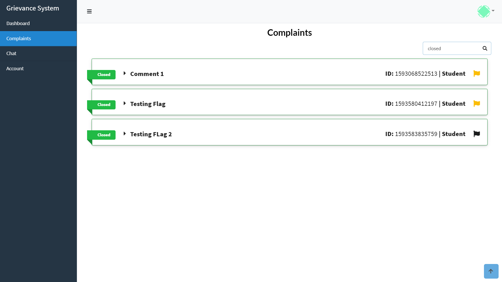

